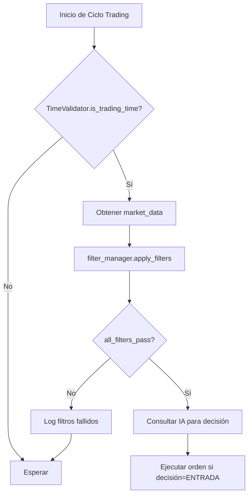

# T36 - Activación de Filtros vía Configuración

## 📋 Información del Ticket

- **Ticket:** T36
- **Título:** Activación de filtros futuros vía configuración
- **Fase:** Fase 0 - Fundamentos
- **Prioridad:** P1
- **Épica:** Épica 11 - Filtros y horarios
- **Estado:** ✅ Completado
- **Fecha:** 6 de Noviembre de 2025

---

## 🎯 Objetivo

Implementar un sistema de filtros configurables que permita habilitar/deshabilitar filtros de volatilidad, spread, eventos económicos y otros a través de archivos JSON, sin necesidad de modificar código fuente.

---

## 🏗️ Arquitectura

### Componentes Principales

#### 1. **FilterManager**
Clase principal que gestiona todos los filtros configurables.

```python
class FilterManager:
    def __init__(self, config: Union[Dict, str, Path], logger: Optional[Logger] = None)
    def load_filters(self, config: Dict) -> None
    def apply_filters(self, market_data: Dict[str, Any]) -> List[FilterResult]
    def all_filters_pass(self, market_data: Dict[str, Any]) -> bool
    def get_filter_summary(self) -> Dict[str, Any]
    def get_filter_statistics(self) -> Dict[str, Any]
    def reload_config(self) -> None
```

**Responsabilidades:**
- Cargar configuración desde dict o archivo JSON
- Instanciar filtros basados en configuración
- Aplicar todos los filtros habilitados a datos de mercado
- Mantener estadísticas de aplicación de filtros
- Permitir recarga de configuración en caliente

#### 2. **BaseFilter (ABC)**
Clase abstracta base para todos los filtros.

```python
class BaseFilter(ABC):
    def __init__(self, config: Dict[str, Any], logger: Optional[Logger] = None)
    def is_enabled(self) -> bool
    
    @abstractmethod
    def apply(self, market_data: Dict[str, Any]) -> FilterResult
```

**Responsabilidades:**
- Definir interfaz común para todos los filtros
- Gestionar estado enabled/disabled
- Forzar implementación de `apply()` en subclases

#### 3. **VolatilityFilter**
Filtro de volatilidad basado en ATR (Average True Range).

```python
class VolatilityFilter(BaseFilter):
    def apply(self, market_data: Dict[str, Any]) -> FilterResult
```

**Lógica:**
- Verifica que `market_data["atr"]` >= `atr_minimum` configurado
- Retorna `FilterResult(passed=True)` si cumple
- Retorna `FilterResult(passed=False, reason="...")` si no cumple o hay error

#### 4. **SpreadFilter**
Filtro de spread máximo en pips.

```python
class SpreadFilter(BaseFilter):
    def apply(self, market_data: Dict[str, Any]) -> FilterResult
```

**Lógica:**
- Verifica que `market_data["spread_pips"]` <= `spread_maximum_pips` configurado
- Retorna `FilterResult(passed=True)` si cumple
- Retorna `FilterResult(passed=False, reason="...")` si no cumple o hay error

#### 5. **FilterResult (Dataclass)**
Resultado de aplicación de un filtro.

```python
@dataclass
class FilterResult:
    passed: bool
    reason: Optional[str] = None
    filter_name: Optional[str] = None
    timestamp: datetime = field(default_factory=lambda: datetime.now(timezone.utc))
    
    def to_dict(self) -> Dict[str, Any]
```

#### 6. **FilterType (Enum)**
Enumeración de tipos de filtros soportados.

```python
class FilterType(str, Enum):
    VOLATILITY = "volatility"
    SPREAD = "spread"
    ECONOMIC_EVENTS = "economic_events"
    DRAWDOWN = "drawdown"
    TIME_FILTER = "time_filter"
    CORRELATION = "correlation"
    CUSTOM = "custom"
    
    @classmethod
    def from_string(cls, filter_type: str) -> Optional["FilterType"]
```

---

## 📝 Configuración

### Archivo: `config/filters.example.json`

```json
{
  "volatility": {
    "enabled": false,
    "atr_minimum": 0.001,
    "description": "Filtro de volatilidad mínima basado en ATR"
  },
  "spread": {
    "enabled": false,
    "spread_maximum_pips": 3,
    "description": "Filtro de spread máximo en pips"
  },
  "economic_events": {
    "enabled": false,
    "high_impact_only": true,
    "currencies": ["USD", "EUR", "GBP"],
    "description": "Filtro de eventos económicos de alto impacto"
  },
  "drawdown": {
    "enabled": false,
    "max_drawdown_percent": 15,
    "description": "Filtro de drawdown máximo de cuenta"
  },
  "time_filter": {
    "enabled": false,
    "avoid_rollover": true,
    "avoid_news_hours": true,
    "description": "Filtro de horarios específicos"
  },
  "correlation": {
    "enabled": false,
    "max_correlation": 0.7,
    "description": "Filtro de correlación máxima entre pares"
  },
  "custom": {
    "enabled": false,
    "description": "Filtros personalizados definidos por el usuario"
  }
}
```

### Ejemplos de Uso

#### Escenario 1: Solo filtro de volatilidad
```json
{
  "volatility": {
    "enabled": true,
    "atr_minimum": 0.0015
  },
  "spread": {
    "enabled": false
  }
}
```

#### Escenario 2: Volatilidad + Spread
```json
{
  "volatility": {
    "enabled": true,
    "atr_minimum": 0.001
  },
  "spread": {
    "enabled": true,
    "spread_maximum_pips": 2
  }
}
```

#### Escenario 3: Todos deshabilitados (trading sin restricciones)
```json
{
  "volatility": {"enabled": false},
  "spread": {"enabled": false},
  "economic_events": {"enabled": false}
}
```

---

## 🔌 Integración

### Con TimeValidator (T35)
```python
from src.core.time_validator import TimeValidator
from src.core.filter_manager import FilterManager

time_validator = TimeValidator()
filter_manager = FilterManager("config/filters.json")

if time_validator.is_trading_time() and filter_manager.all_filters_pass(market_data):
    # Proceder con trading
    pass
```

### Con Logger (T39)
```python
from src.core.logger import Logger, LogConfig, LogLevel
from src.core.filter_manager import FilterManager

log_config = LogConfig(log_dir="logs", level=LogLevel.INFO)
logger = Logger(log_config)
filter_manager = FilterManager("config/filters.json", logger=logger)

results = filter_manager.apply_filters(market_data)
for result in results:
    if not result.passed:
        logger.warning(f"Filtro {result.filter_name} falló: {result.reason}")
```

### Con ConfigLoader (T44)
```python
from src.core.config_loader import ConfigLoader
from src.core.filter_manager import FilterManager

config_loader = ConfigLoader()
filters_config = config_loader.load_config("filters.json")
filter_manager = FilterManager(filters_config)
```

### Recarga en Caliente
```python
# Modificar config/filters.json durante ejecución
filter_manager.reload_config()  # Sin perder estadísticas acumuladas
```

---

## 🧪 Testing

### Cobertura: **86%**

### Suites de Tests

#### 1. **TestFilterManagerInitialization** (4 tests)
- `test_filter_manager_init_with_dict` ✅
- `test_filter_manager_init_with_file` ✅
- `test_filter_manager_init_with_default_config` ✅
- `test_filter_manager_init_with_logger` ✅

#### 2. **TestFilterApplication** (4 tests)
- `test_apply_filters_all_pass` ✅
- `test_apply_filters_some_fail` ✅
- `test_all_filters_pass_true` ✅
- `test_all_filters_pass_false` ✅

#### 3. **TestVolatilityFilter** (4 tests)
- `test_volatility_filter_pass` ✅
- `test_volatility_filter_fail` ✅
- `test_volatility_filter_missing_atr` ✅
- `test_volatility_filter_invalid_atr` ✅

#### 4. **TestSpreadFilter** (4 tests)
- `test_spread_filter_pass` ✅
- `test_spread_filter_fail` ✅
- `test_spread_filter_missing_spread` ✅
- `test_spread_filter_invalid_spread` ✅

#### 5. **TestFilterResult** (2 tests)
- `test_filter_result_creation` ✅
- `test_filter_result_to_dict` ✅

#### 6. **TestFilterType** (4 tests)
- `test_filter_type_enum_values` ✅
- `test_filter_type_from_string_valid` ✅
- `test_filter_type_from_string_invalid` ✅
- `test_filter_type_string_values` ✅

#### 7. **TestFilterSummary** (2 tests)
- `test_get_filter_summary` ✅
- `test_get_filter_statistics` ✅

#### 8. **TestConfigReloading** (2 tests)
- `test_reload_config_updates_filters` ✅
- `test_reload_config_preserves_statistics` ✅

#### 9. **TestFilterIntegration** (2 tests)
- `test_integration_with_logger` ✅
- `test_integration_with_time_validator` ✅

#### 10. **TestEdgeCases** (4 tests)
- `test_empty_market_data` ✅
- `test_none_market_data` ✅
- `test_malformed_config` ✅
- `test_disabled_filters_not_applied` ✅

**Total:** 32 tests, 100% passing

### Ejecutar Tests
```bash
# Tests unitarios de FilterManager
pytest tests/unit/test_filter_manager.py -v

# Con cobertura
pytest tests/unit/test_filter_manager.py -v --cov=src.core.filter_manager --cov-report=term-missing

# Suite completa
pytest tests/ -v --cov=src
```

---

## 📊 Estadísticas de Filtros

### Método: `get_filter_statistics()`

Retorna estadísticas acumuladas de aplicación de filtros:

```python
{
    "total_applications": 150,
    "filters": {
        "volatility": {
            "applications": 75,
            "passed": 60,
            "failed": 15,
            "pass_rate": 0.80
        },
        "spread": {
            "applications": 75,
            "passed": 70,
            "failed": 5,
            "pass_rate": 0.93
        }
    },
    "overall_pass_rate": 0.87
}
```

**Uso:**
- Monitoreo de efectividad de filtros
- Ajuste de parámetros basado en tasas de paso
- Debugging de filtros demasiado restrictivos

---

## 🚀 Flujo de Ejecución



---

## 🔧 Mantenimiento

### Agregar Nuevo Filtro

1. **Crear clase de filtro:**
```python
class NewFilter(BaseFilter):
    def apply(self, market_data: Dict[str, Any]) -> FilterResult:
        # Implementar lógica
        if condition_met:
            return FilterResult(passed=True, filter_name="new_filter")
        return FilterResult(passed=False, reason="...", filter_name="new_filter")
```

2. **Registrar en FilterManager:**
```python
# En FilterManager.load_filters()
if "new_filter" in config and config["new_filter"].get("enabled", False):
    self.filters.append(NewFilter(config["new_filter"], self.logger))
```

3. **Agregar a filters.example.json:**
```json
{
  "new_filter": {
    "enabled": false,
    "parameter_1": "value",
    "description": "Descripción del nuevo filtro"
  }
}
```

4. **Escribir tests:**
```python
class TestNewFilter:
    def test_new_filter_pass(self):
        # ...
    
    def test_new_filter_fail(self):
        # ...
```

---

## 🐛 Casos Edge Manejados

1. **market_data es None:**
   - Retorna `FilterResult(passed=False, reason="Market data is None")`

2. **market_data vacío:**
   - Retorna `FilterResult(passed=False, reason="Market data is empty")`

3. **Valor de campo es None:**
   - Ejemplo: `market_data["atr"] = None`
   - Retorna `FilterResult(passed=False, reason="ATR value is None")`

4. **Tipo inválido:**
   - Ejemplo: `market_data["atr"] = "invalid"`
   - Retorna `FilterResult(passed=False, reason="Invalid ATR value type")`

5. **Config malformado:**
   - Lanza `FilterValidationError` con mensaje descriptivo

6. **Archivo de config no existe:**
   - Lanza `FileNotFoundError` con path completo

---

## 📈 Mejoras Futuras

### Corto Plazo
- [ ] Implementar `EconomicEventsFilter` (integración con API de noticias)
- [ ] Implementar `DrawdownFilter` (consulta estado de cuenta)
- [ ] Implementar `CorrelationFilter` (análisis multi-par)

### Mediano Plazo
- [ ] Filtros adaptativos basados en ML
- [ ] Dashboard de visualización de estadísticas de filtros
- [ ] Notificaciones cuando filtros fallan consistentemente

### Largo Plazo
- [ ] Filtros predictivos con análisis de tendencias
- [ ] A/B testing de configuraciones de filtros
- [ ] Optimización automática de parámetros

---

## 📚 Referencias

- **Issue GitHub:** #36
- **Branch:** `feature/T36-filtros-configurables`
- **Archivos Modificados:**
  - `src/core/filter_manager.py` (182 líneas, nuevo)
  - `tests/unit/test_filter_manager.py` (519 líneas, nuevo)
  - `config/filters.example.json` (165 líneas, nuevo)
  - `README.md` (actualizado con T36)

---

## ✅ Checklist de Implementación

- [x] Diseñar arquitectura de filtros
- [x] Crear `BaseFilter` clase abstracta
- [x] Implementar `VolatilityFilter`
- [x] Implementar `SpreadFilter`
- [x] Implementar `FilterManager`
- [x] Crear `FilterResult` dataclass
- [x] Crear `FilterType` enum
- [x] Crear `filters.example.json`
- [x] Escribir 32 tests unitarios (TDD)
- [x] Lograr 86% cobertura
- [x] Integrar con Logger (T39)
- [x] Documentar en README.md
- [x] Crear documentación técnica (este archivo)
- [x] Validar 0 regresiones (301 tests passing)
- [x] Commit y merge a desarrollo

---

**Última actualización:** 6 de Noviembre de 2025  
**Autor:** Sistema TDD Automatizado  
**Revisión:** Pendiente
